# CodeVS — Real-Time Multiplayer Code Typing Arena

<p align="center">
  <a href="https://codevs-a9bf1.web.app"></a>
  <a href="https://github.com/narukami00/CodeVS"></a>
</p>

<p align="center">
  
  
  
  
  
  
  
  
</p>

<p align="center">
  <em>Two players. One snippet. Type faster, type cleaner — WPM × Accuracy decides the winner.</em><br>
  <strong>Hacker-dark</strong> React SPA with sub-second Firebase synchronisation, 6-language snippet bank, and a global leaderboard.
</p>

<p align="center">
  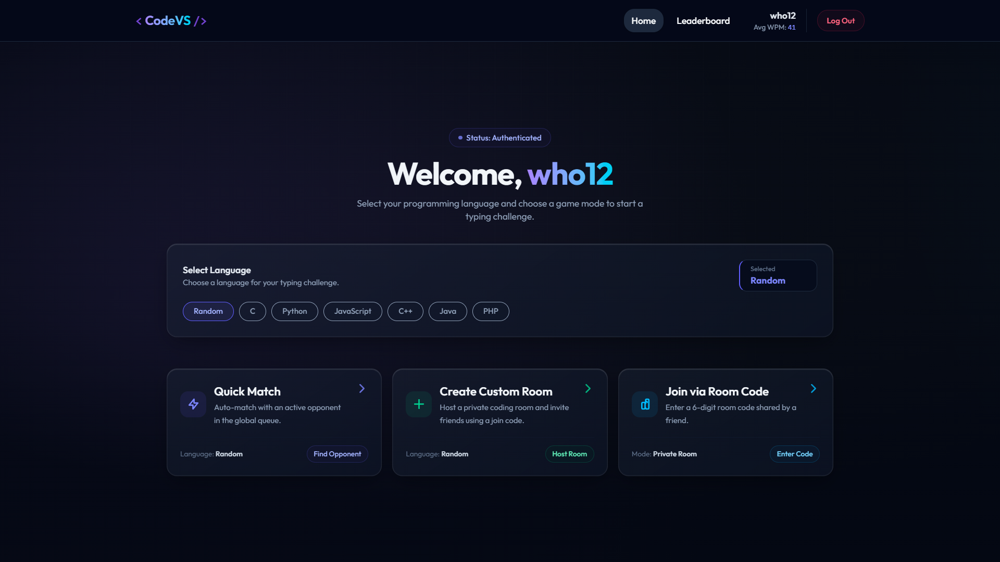
</p>

---

## 📑 Table of Contents

- [Overview](#-overview)
- [Features](#-features)
- [Tech Stack](#-tech-stack)
- [Architecture](#-architecture)
  - [Component Diagram](#component-diagram)
  - [UML Class Diagram](#uml-class-diagram)
  - [Use Case Diagram](#use-case-diagram)
  - [Activity Diagram](#activity-diagram)
  - [Sequence Diagram](#sequence-diagram)
  - [Data Flow Diagrams](#data-flow-diagrams)
- [Project Structure](#-project-structure)
- [Data Models](#-data-models)
  - [Firestore](#firestore-codevssrcfirebasejs18--firestore)
  - [Realtime Database](#realtime-database-codevssrcfirebasejs17--db)
  - [Presence & onDisconnect](#presence--ondisconnect)
- [Routes & Navigation](#-routes--navigation)
- [Core Logic & Formulas](#-core-logic--formulas)
- [Firebase API Surface](#-firebase-api-surface)
- [UI Gallery](#-ui-gallery)
- [Agile & Jira — Scrum Delivery](#-agile--jira--scrum-delivery)
  - [Epics Overview](#epics-overview)
  - [Sprint Lifecycle](#sprint-lifecycle)
  - [Task Division & Contributions](#task-division--contributions)
  - [Jira Workflow](#jira-workflow)
- [Version Control & Git Workflow](#-version-control--git-workflow)
- [QA & Zephyr Scale — Test Cycle](#-qa--zephyr-scale--test-cycle)
- [Project Outcomes & Metrics](#-project-outcomes--metrics)
- [Assets Index](#-assets-index)
- [Local Setup Guide](#-local-setup-guide)
- [Deployment](#-deployment)
- [Team](#-team)
- [Appendix — Full Asset Manifest](#-appendix--full-asset-manifest)

---

## 🔭 Overview

**CodeVS** is a real-time multiplayer web application that makes competitive programming practice engaging and social. Two authenticated players are matched together and simultaneously type out the **same randomly-selected code snippet** in a chosen language (`C`, `Python`, `JavaScript`, `C++`, `Java`, `PHP`, or `Random`). Performance is measured in **Words Per Minute (WPM)** and **Accuracy (%)**, persisted to a global leaderboard, and revealed on an animated result screen with rematch support.

> **Live:** [https://codevs-a9bf1.web.app](https://codevs-a9bf1.web.app) · **Repo:** [narukami00/CodeVS](https://github.com/narukami00/CodeVS) · **Report assets:** [`docs/assets/`](docs/assets/) · **Summary:** [`docs/PROJECT_SUMMARY.md`](docs/PROJECT_SUMMARY.md) · **Asset manifest:** [`docs/assets/INDEX.md`](docs/assets/INDEX.md)

**Why Firebase?** The game requires <250 ms opponent-progress latency and presence detection. Firestore holds durable state (users, snippets, leaderboard); Realtime Database handles ephemeral, high-frequency state (rooms, queues, per-keystroke progress) with `onValue` listeners and `onDisconnect` presence — a split the report validates as well-suited to low-latency multiplayer sync.

---

## ✨ Features

| Feature | Detail |
|---|---|
| **Auth** | Email/password via Firebase Auth; sessions persist across refreshes; `ProtectedRoute` guards; username uniqueness enforced |
| **Matchmaking** | Global **Quick Match** queue (language-specific, 60 s timeout) with atomic `runTransaction` claim + UID `>` tie-breaker; **Private Rooms** with 6-char `XXXXXX` room codes |
| **Lobby** | Ready-toggle handshake, VS panel, auto snippet assignment by creator after `bothReady`, ghost-lobby 15 s reaper |
| **Live Game** | Character-level validation, cursor advances only on correct key, Backspace rewinds, shake on error, `WPM = (correct/5)/(sec/60)`, `Accuracy = correct/total×100`, opponent ghost progress + bar, `onDisconnect` forfeit |
| **Result** | Winner reveal, both players' WPM/Accuracy, **Rematch** state machine (private rooms: both must accept → room wipe & reset; decline → home) |
| **Leaderboard** | Global top-10 by `average_wpm` desc (podium + table + mobile cards), `runTransaction` rolling average, quickmatch-only eligibility |
| **Languages** | `Random` (resolved to one of 5 at match time), `C`, `Python`, `JavaScript`, `C++`, `Java`, `PHP` — snippet bank in Firestore |
| **Resilience** | `onDisconnect` presence on queue & room, race/claim handling, latency-optimized `update` per keystroke, cross-browser & mobile responsive |

---

## 🧱 Tech Stack

| Layer | Technology | Version | Purpose |
|---|---|---|---|
| Build | **Vite** | `^8.0.12` | Dev server, HMR, `dist/` build |
| UI | **React** | `^19.2.6` | SPA, hooks, components |
| DOM | **React-DOM** | `^19.2.6` |  |
| Routing | **React Router DOM** | `^7.15.1` | SPA routes, `ProtectedRoute` |
| Styling | **Tailwind CSS** + `@tailwindcss/postcss` + **PostCSS** | `^4.3.0` / `^8.5.15` | Hacker-dark theme, `glass-card`, `bg-grid`/`bg-vignette` |
| Backend | **Firebase JS SDK** | `^12.15.0` | Auth + Firestore + RTDB |
| Hosting | **Firebase Hosting** | — | SPA rewrite `** → /index.html` (`codevs/firebase.json:9-13`) |
| Lint | **ESLint** + `eslint-plugin-react-hooks`/`react-refresh` + `@eslint/js` + `globals` | `^10.3.0` | `npm run lint` |
| Tooling | **@vitejs/plugin-react** | `^6.0.1` | JSX fast refresh |

**Config:** `codevs/vite.config.js:1-7` (single `react()` plugin), `codevs/postcss.config.js`, `codevs/eslint.config.js`, `codevs/firebase.json:1-16`, `codevs/index.html`

**Scripts (`codevs/package.json:6-12`):**

```bash
npm run dev      # vite — HMR at http://localhost:5173
npm run build    # vite build → dist/
npm run preview  # vite preview
npm run lint     # eslint .
npm run deploy   # firebase deploy --only hosting
```

**Environment** (`codevs/.env.example` → `codevs/src/firebase.js:6-14` via `import.meta.env`):

```ini
VITE_FIREBASE_API_KEY=
VITE_FIREBASE_AUTH_DOMAIN=
VITE_FIREBASE_DATABASE_URL=
VITE_FIREBASE_PROJECT_ID=
VITE_FIREBASE_STORAGE_BUCKET=
VITE_FIREBASE_MESSAGING_SENDER_ID=
VITE_FIREBASE_APP_ID=
```

---

## 🏗 Architecture

> All diagrams are extracted from `CodeVS_Project_Report.docx` + `CodeVS_Workflow_Presentation.pptx` → [`docs/assets/`](docs/assets/). Hash-deduplicated (11 overlaps collapsed). See [`docs/assets/INDEX.md`](docs/assets/INDEX.md) for source→hash mapping.

### Component Diagram

High-level boundaries: React SPA ↔ Firebase Auth / Firestore / RTDB / Hosting.

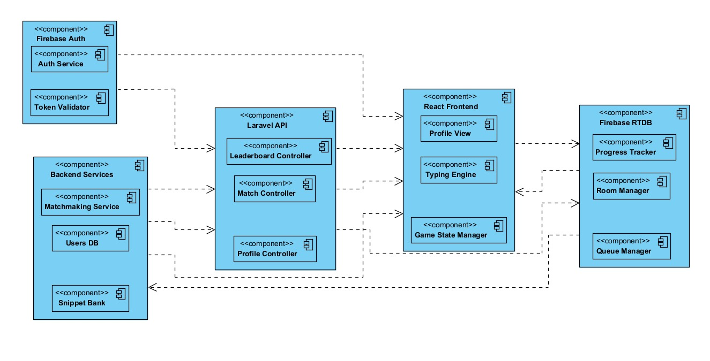

> Alt export (docx, 62 KB PNG — same content, lower res):


### UML Class Diagram

Major classes — `User`, `Room`, `Game`, `Snippet`, `Leaderboard` — with associations, multiplicities and methods as modeled in React + Firebase.

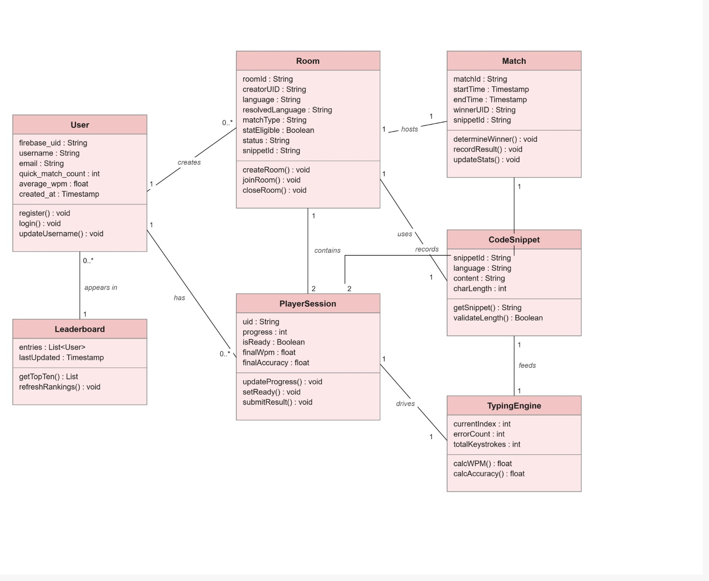

### Use Case Diagram

Actors: **Guest User**, **Authenticated Player**, **System/Firebase** → all primary use cases.

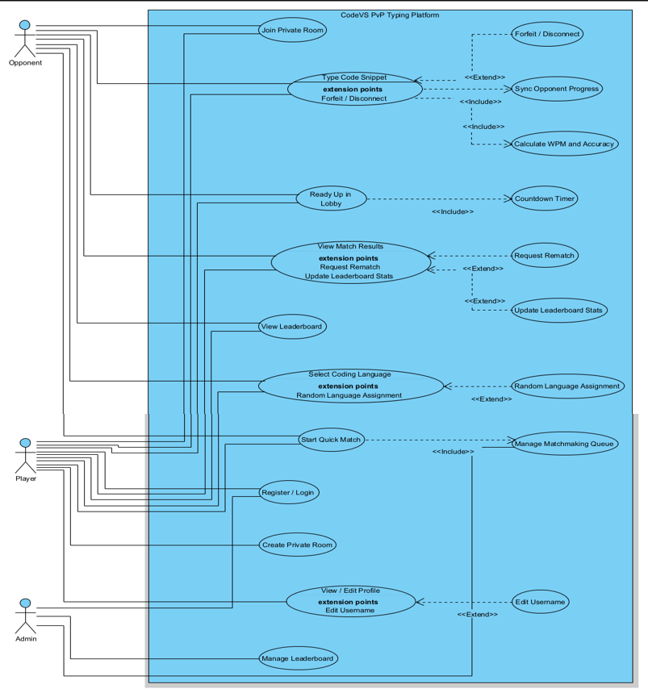

### Activity Diagram

End-to-end flow: authentication → matchmaking → live game loop → post-match result/rematch.

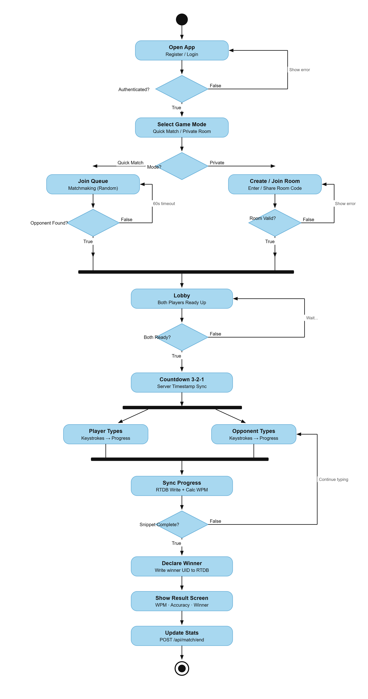

### Sequence Diagram

Interaction timeline: **Client (React)** ↔ **Firebase Auth** ↔ **Firestore** ↔ **Realtime Database** during a complete multiplayer match.


### Data Flow Diagrams

**Level 0 — Context:** single CodeVS process with external entities Player, Firebase Auth, Firestore/RTDB.

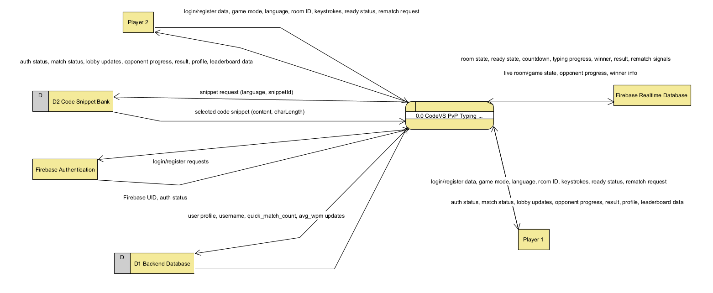

**Level 1 — Main Processes:** five processes — User Authentication, Matchmaking, Game Session Management, Score Calculation, Leaderboard Management.

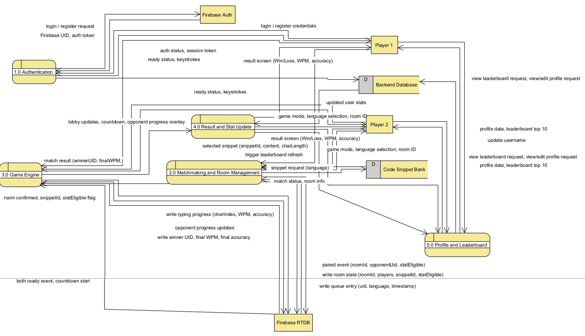

**Level 2 — Sub-Process Details:** decomposition of Matchmaking & Game Session Management (room creation, ready-state, snippet assignment, typing validation) — 5 views:

| A | B | C | D | E |
|---|---|---|---|---|
| 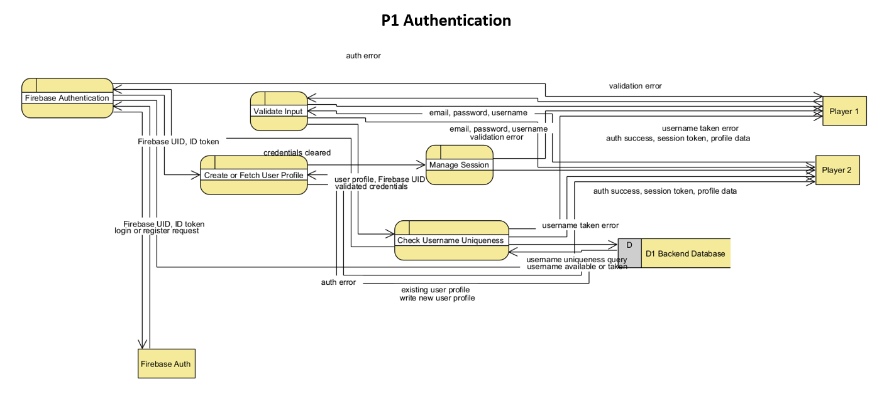 | 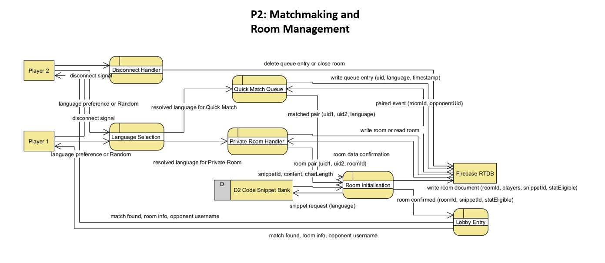 |  |  | 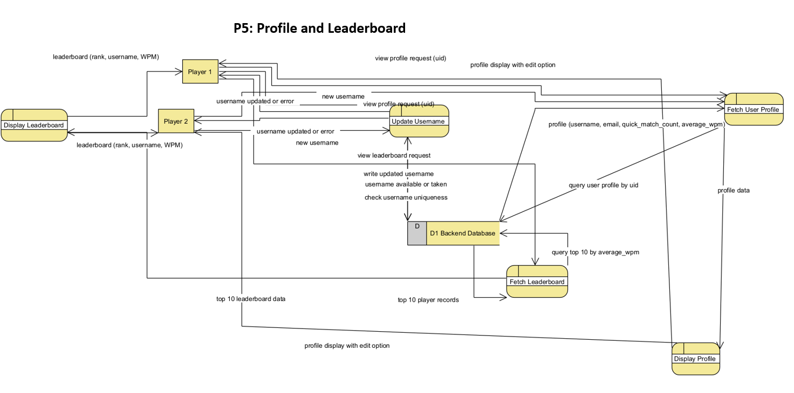 |

---

## 📁 Project Structure

```
CodeVS/
├── README.md                         # ← you are here
├── docs/
│   ├── PROJECT_SUMMARY.md            # exhaustive tech/model/API reference
│   └── assets/
│       ├── INDEX.md                  # 76 images — descriptions + hash→source map
│       ├── _manifest.json            # reproducible SHA-256 manifest
│       ├── uml-class-diagram.jpg
│       ├── component-diagram.jpg
│       ├── use-case-diagram.png
│       ├── activity-diagram.png
│       ├── sequence-diagram.png
│       ├── dfd-level0-context.png
│       ├── dfd-level1-main-processes.png
│       ├── dfd-level2-a..e.png
│       ├── ui-*.png                  # 8 UI screenshots
│       ├── jira-*.png / screenshot-jira-*.png
│       ├── github-*.png / git-*.png
│       ├── zephyr-*.png
│       ├── outcomes-*.png
│       └── pdf-page*.png             # 22 PDF-rasterized extras
├── CodeVS_Project_Report.docx        # source report (22 word/media/*)
├── CodeVS_Project_Report.pdf         # PDF export (24 page images)
├── CodeVS_Workflow_Presentation.pptx # 34 slides (47 ppt/media/*)
├── CodeVS_Zephyr_Testing_Report.docx # Zephyr report (thumbnail only)
└── codevs/                           # Vite + React app
    ├── index.html
    ├── vite.config.js                # react() only — codevs/vite.config.js:1-7
    ├── firebase.json                 # hosting public=dist, SPA rewrite
    ├── package.json
    ├── .env / .env.example
    ├── public/
    │   ├── favicon.svg
    │   └── icons.svg
    └── src/
        ├── main.jsx                  # BrowserRouter + App
        ├── App.jsx                   # Routes + AuthProvider + Navbar (App.jsx:14-31)
        ├── App.css / index.css
        ├── firebase.js               # initializeApp + getAuth/getFirestore/getDatabase (firebase.js:16-19)
        ├── contexts/
        │   └── AuthContext.jsx       # register/login/logout, onAuthStateChanged + Firestore merge
        ├── hooks/
        │   ├── useGameEngine.js      # charStates, cursor, WPM/Accuracy, handleKeyDown, progress sync
        │   ├── useMatchmaking.jsx    # queues/{lang}/{uid}, matchmaking_results, runTransaction claim
        │   └── useRooms.jsx          # createRoom (6-char ID), joinRoom validation
        ├── data/
        │   ├── languages.js          # 7 options: random/c/cpp/python/javascript/java/php
        │   └── snippetBank.js        # getRandomSnippetId(lang) via snippet_metadata/{lang}.ids
        ├── utils/
        │   └── formatters.js         # formatPercent, formatTime
        ├── components/
        │   ├── Navbar.jsx
        │   ├── ProtectedRoute.jsx
        │   └── game/
        │       ├── PlayerPanel.jsx
        │       ├── CompactOpponentCard.jsx
        │       ├── ProgressBar.jsx
        │       ├── StatPill.jsx
        │       └── CodeGhostText.jsx
        ├── pages/
        │   ├── Home.jsx              # language picker + QuickMatch/Create/Join
        │   ├── Lobby.jsx             # ready handshake, bothReady → snippet → /game
        │   ├── Game.jsx              # snippet fetch, useGameEngine, winner transaction, countdown
        │   ├── Result.jsx            # winner, stats, rematch, leaderboard transaction
        │   ├── Leaderboard.jsx       # orderBy average_wpm desc, podium + table
        │   ├── Login.jsx
        │   ├── Register.jsx
        │   └── Profile.jsx
        └── assets/
            ├── hero.png
            ├── react.svg
            └── vite.svg
```

---

## 🗄 Data Models

### Firestore (`codevs/src/firebase.js:18` → `firestore`)

**`users/{uid}`** — created in `AuthContext.jsx:52-60` on `register`, updated in `Result.jsx:181-195`:

```js
{
  username: string,           // unique — checked via query(where('username','==',username)) — AuthContext.jsx:40
  email: string,
  quick_match_count: number,  // default 0, ++ per quickmatch
  average_wpm: number,        // rolling avg: ((oldAvg * oldGames) + wpm) / newGames
  created_at: serverTimestamp()
}
```

**`snippets/{snippetId}`** — fetched in `Game.jsx:111`:

```js
{ code: string }  // full source text to type; fallback mockSnippet (Game.jsx:14-17) if missing
```

**`snippet_metadata/{language}`** — read in `snippetBank.js:10`:

```js
{ ids: string[] }  // random pick via Math.random(); fallback 'fallback-snippet-id'
```

Languages: `c`, `python`, `javascript`, `cpp`, `java`, `php` (+ `random` resolved client-side) — `languages.js:1-9`.

### Realtime Database (`codevs/src/firebase.js:17` → `db`)

**`rooms/{roomId}`** — 6-char uppercase `Math.random().toString(36).substring(2,8).toUpperCase()` (`useRooms.jsx:23`, `useMatchmaking.jsx:120`):

```js
{
  creatorUID: string,
  language: string,            // original picker ('random'|'cpp'|...)
  resolvedLanguage: string,    // random → actual (langs pick), else == language
  snippetId: string | null,    // set by lobby creator after bothReady via getRandomSnippetId()
  status: 'waiting' | 'full' | 'active',
  matchType: 'quickmatch' | 'private',
  statEligible: boolean,       // quickmatch && language=='random' only
  winner: string | null,       // uid — runTransaction on finish (Game.jsx:119-124) or disconnect forfeit
  reason: string | null,       // 'opponent_disconnected'
  countdownStart: serverTimestamp() | null,
  rematchRequests: { [uid]: true } | null,  // private rooms only (Result.jsx:144-164)
  players: {
    [uid]: { ready: boolean, progress: number, stats: { wpm: number, accuracy: number } | null }
  }
}
```

**`queues/{language}/{uid}`** — `useMatchmaking.jsx:46-47`:

```js
{ joinedAt: serverTimestamp(), _claim?: string }  // _claim = claimer uid during transaction
```

**`matchmaking_results/{uid}`** — `useMatchmaking.jsx:55-58,148` — transient: value is `roomId` string, removed on read.

### Presence & onDisconnect

- **Queue:** `onDisconnect(queueRef).remove()` on enter (`useMatchmaking.jsx:50-52`), cancelled on match/timeout.
- **Room player:** `onDisconnect(rooms/{id}/players/{uid}).remove()` in `Lobby.jsx:168`, `Game.jsx:45-46` — triggers opponent win/forfeit.
- **Ghost timeouts:** Lobby 15 s if `quickmatch` and no opponent (`Lobby.jsx:324-336`); matchmaking 60 s (`useMatchmaking.jsx:186-189`).

---

## 🧭 Routes & Navigation

| Path | Component | Guard | Query | Description |
|---|---|---|---|---|
| `/login` | `Login.jsx` | public | — | Firebase email/password |
| `/register` | `Register.jsx` | public | — | Username uniqueness + `createUserWithEmailAndPassword` |
| `/` | `Home.jsx` | `ProtectedRoute` | — | 7-chip language picker + Quick Match / Create Room / Join modal |
| `/lobby?roomId=XXXXXX` | `Lobby.jsx` | protected | `roomId` | Ready toggle, VS panel, bothReady → assign snippet → countdown → `/game` |
| `/game?roomId=XXXXXX` | `Game.jsx` | protected | `roomId` | Split panels, `useGameEngine`, 3-2-1 countdown, live progress |
| `/result?roomId=XXXXXX` | `Result.jsx` | protected | `roomId` | Winner, WPM/Accuracy, rematch (private), leaderboard `runTransaction` |
| `/leaderboard` | `Leaderboard.jsx` | **public** (`App.jsx:27`) | — | Global top-10 by `average_wpm` |
| `/profile` | `Profile.jsx` | protected | — | Current user profile |

`ProtectedRoute.jsx` redirects unauthenticated → `/login`. `Navbar.jsx` is present on all routes.

---

## 🧮 Core Logic & Formulas

### WPM (`useGameEngine.js:40-45`, `Game.jsx:183`, `Result.jsx:183`)

```js
wpm = (correctChars / 5) / (elapsedSeconds / 60)   // 5 chars = 1 word, rounded
```

Live display is `—` until `startedAt` and `elapsedSeconds >= 1`. Final: `Math.round((correctChars/5)/minutes)`.

### Accuracy (`useGameEngine.js:47-51`, `Game.jsx:184`)

```js
accuracy = (correctKeystrokes / totalKeystrokes) * 100
// live: Math.round  —  final: Math.round(x*10)/10 (Result.jsx:11,84)
```

Char states: `'c'` correct / `'e'` error / `''` pending (`useGameEngine.js:19,109,133`). **Backspace rewinds** `progress` (`useGameEngine.js:68-79`). Wrong key does **not** advance cursor — triggers 400 ms shake (`isError`).

### Progress Sync

- Each correct keystroke & Backspace: `update(ref(db, rooms/{id}/players/{uid}), {progress: nextIndex})` (`useGameEngine.js:78,116`).
- Opponent progress: `roomData.players[oppUid].progress / snippet.length * 100` → `PlayerPanel` progress bar + `CodeGhostText`.
- Winner: `runTransaction(rooms/{id}, d => { if(!d.winner) d.winner = uid })` — first finisher wins (`useGameEngine.js:119-124`).

### Leaderboard (`Leaderboard.jsx:232-236`, `Result.jsx:181-195`)

- **Query:** `query(collection(firestore,'users'), orderBy('average_wpm','desc'), limit(50))` → normalize → filter `gamesPlayed >= 1` → `sortByRankRules` (WPM desc → games desc → username) → top 10.
- **Write (quickmatch only, once per result):** `runTransaction(users/{uid}, {quick_match_count: old+1, average_wpm: ((oldAvg*oldGames)+wpm)/newGames})`.
- **UI:** Podium (ranks 1-3 Gold/Silver/Bronze) + table + mobile cards.

---

## 🔌 Firebase API Surface

> No REST — all Firebase JS SDK calls. Source-mapped to file:line.

### Auth (`AuthContext.jsx`)

- `createUserWithEmailAndPassword(auth,email,password)` + `setDoc(users/{uid}, {username,email,quick_match_count:0,average_wpm:0})` — `register()`
- `signInWithEmailAndPassword(auth,email,password)` — `login()`
- `signOut(auth)` — `logout()`
- `onAuthStateChanged(auth, cb)` → `fetchUserProfile(uid)` via `getDoc(users/{uid})` — merges `firebaseUser` + profile into `user`
- Username uniqueness: `query(users, where('username','==',username))` before create

### Firestore

| Call | Location | Purpose |
|---|---|---|
| `getDoc(doc(firestore,'users',uid))` | `AuthContext.jsx:24` | Profile fetch |
| `getDoc(doc(firestore,'snippets',snippetId))` | `Game.jsx:111` | Load code to type |
| `getDoc(doc(firestore,'snippet_metadata',lang))` | `snippetBank.js:10` | Random snippet pool |
| `getDocs(query(users, orderBy('average_wpm','desc'), limit(50)))` | `Leaderboard.jsx:235` | Rankings |
| `runTransaction(users/{uid}, update avg)` | `Result.jsx:181` | Leaderboard increment |

### Realtime Database

| Call | Location | Purpose |
|---|---|---|
| `set(queues/{lang}/{uid}, {joinedAt})` + `onDisconnect().remove()` | `useMatchmaking.jsx:46` | Enter queue |
| `onValue(matchmaking_results/{uid})` | `useMatchmaking.jsx:56` | Matched notification → lobby |
| `onValue(queues/{lang})` + `runTransaction(queues/{lang}/{oppUid}, claim)` + UID `>` tie-breaker | `useMatchmaking.jsx:76-113` | Atomic opponent claim |
| `set(rooms/{id}, {creatorUID,language,resolvedLanguage,snippetId,status,matchType,statEligible,players})` | `useMatchmaking.jsx:133`, `useRooms.jsx:32` | Create room |
| `get(rooms/{id})` + `update(players/{uid}, ready/progress)` | `useRooms.jsx:70`, `Lobby.jsx:290` | Join / ready toggle |
| `onValue(rooms/{id})` | `Lobby.jsx:171`, `Game.jsx:48`, `Result.jsx:116` | Live room sync |
| `update(rooms/{id}/players/{uid}, {progress})` | `useGameEngine.js:78,116` | Typing progress |
| `runTransaction(rooms/{id}, set winner)` | `useGameEngine.js:119` | First finisher wins |
| `update(rooms/{id}, {snippetId,countdownStart})` | `Lobby.jsx:305` | Creator assigns snippet after bothReady |
| `update(rooms/{id}/players/{uid}, {stats:{wpm,accuracy}})` | `Game.jsx:187` | Final stats before `/result` |
| `update(rooms/{id}, {winner,reason})` on `<2 players` | `Game.jsx:76` | Forfeit handling |
| `remove(rooms/{id})` / `remove(rooms/{id}/players/{uid})` | `Lobby.jsx:199,230`, `Game.jsx:203` | Leave/forfeit |
| `update(rooms/{id}, {rematchRequests/{uid}:true})` + wipe when 2 | `Result.jsx:264,151` | Private rematch handshake |

---

## 🎨 UI Gallery

> All screenshots are `docs/assets/ui-*.png` extracted from `CodeVS_Workflow_Presentation.pptx` (slides 15-19). Click to enlarge.

| Landing | Sign-Up | Log-In |
|---|---|---|
|  | 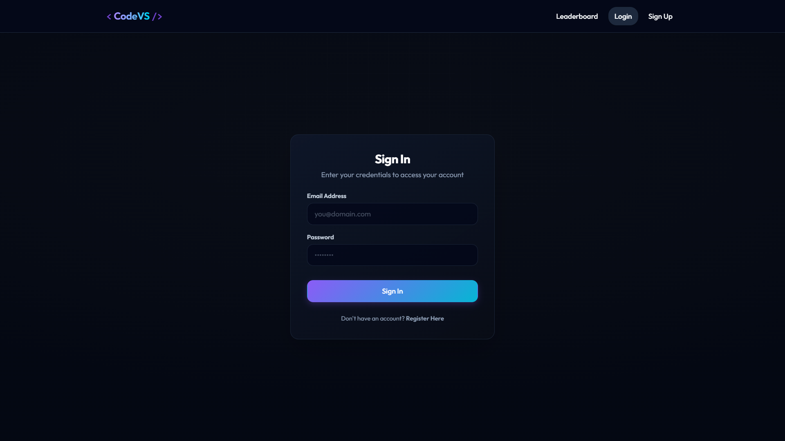 | 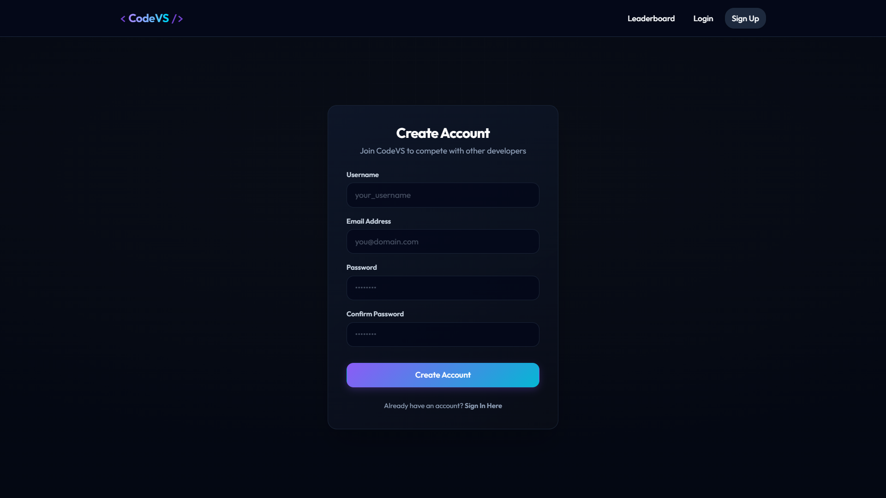 |
| Hacker-dark hero, animated mesh/grid/vignette, status pill, language hint | Email/username/password, validation, Firebase create | Email/password, `signInWithEmailAndPassword`, redirect to `/` |

| Profile | Leaderboard | Typing Contest |
|---|---|---|
| 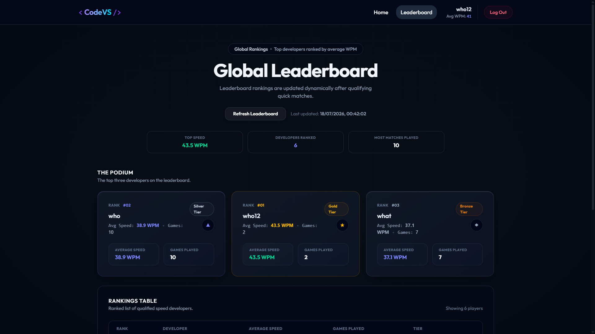 | 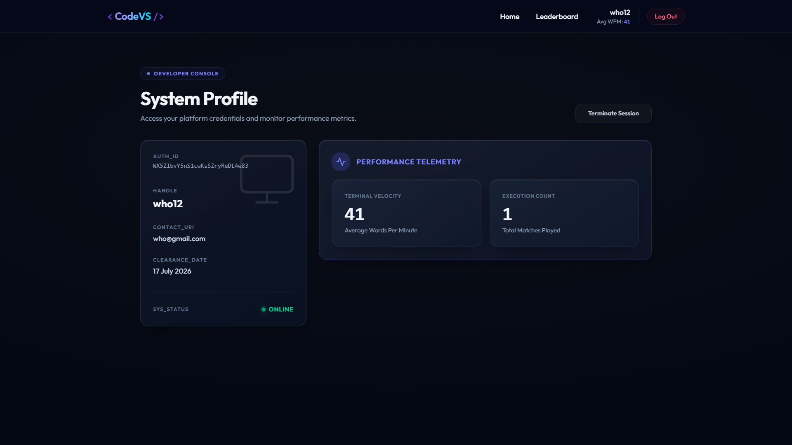 | 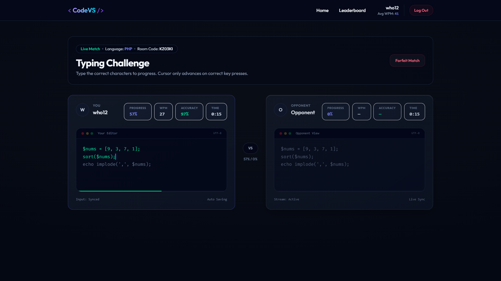 |
| `users/{uid}` stats, `quick_match_count`, `average_wpm` | Podium + table, `orderBy average_wpm desc`, top-10 | Split `PlayerPanel`s, live progress, WPM/Accuracy, `CodeGhostText` |

| Matchmaking — Create | Matchmaking — Join |
|---|---|
| 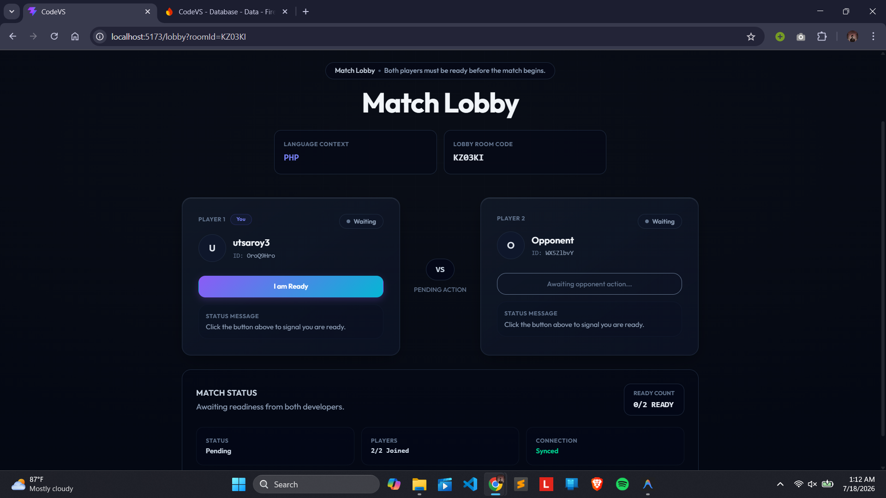 | 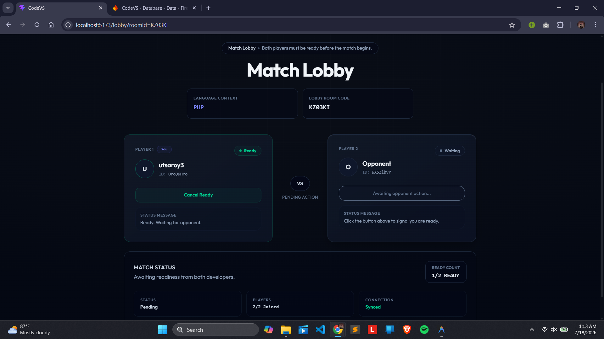 |
| Host generates 6-char `roomId`, `rooms/{id}` with `status:'waiting'` | Guest enters `XXXXXX`, `get(rooms/{id})` validation, `status:'full'` |

---

## 📋 Agile & Jira — Scrum Delivery

> Source: `CodeVS_Project_Report.docx` §4-6 + `CodeVS_Workflow_Presentation.pptx` slides 20-30. Screenshots extracted to `docs/assets/jira-*.png` / `screenshot-jira-*.png`.

### Epics Overview

Five high-level epics, 113 total issues (26 Tasks + 82 Subtasks + 5 Epics), 3 sprints — **100% Done**.

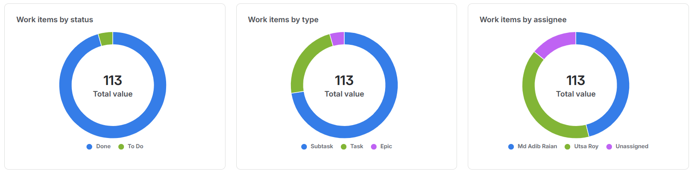

> Detail table (docx §4.2):


| Key | Epic | Scope | Tasks |
|---|---|---|---|
| **SCRUM-1** | Project Setup & Auth | Repo, Firebase project, React scaffold, auth flows, Firestore schema | 4 |
| **SCRUM-2** | Matchmaking System | Quick-match queue, custom room creation (`XXXXXX`), room-join workflow | 3 |
| **SCRUM-3** | Game Engine | Ready-state sync, WPM/Accuracy, opponent status, rematch, language picker, edge cases | 6 |
| **SCRUM-4** | UI & Frontend | All screen UIs + global theming + mobile responsiveness | 8 |
| **SCRUM-5** | Snippet Bank & Leaderboard | 6-language curation, leaderboard persistence, ranking queries, testing & deploy | 5 |

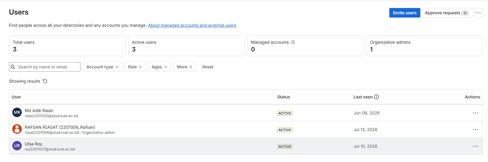

### Sprint Lifecycle


**Sprint 1 — Project Foundation** — *Establish structure, routing, DB schemas, auth, initial layout.* 20 issues (9 Tasks + 11 Subtasks).

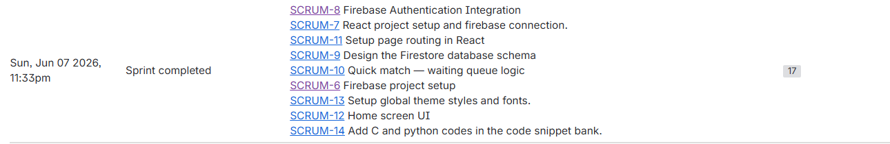

> Detail:

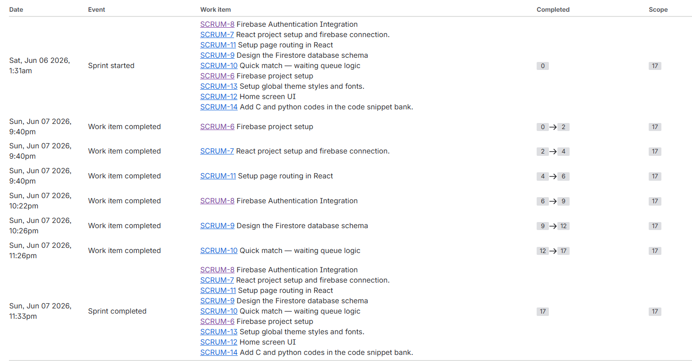

| Issue | Summary | Assignee |
|---|---|---|
| SCRUM-6 | Firebase project setup | Rafsan |
| SCRUM-7 | React project setup & Firebase connection | Rafsan |
| SCRUM-8 | Firebase Authentication integration | Utsa |
| SCRUM-9 | Design Firestore database schema | Utsa |
| SCRUM-10 | Quick match — waiting queue logic | Utsa |
| SCRUM-11 | Setup page routing in React | Rafsan |
| SCRUM-12 | Home screen UI (+3 subtasks) | Adib |
| SCRUM-13 | Setup global theme styles & fonts (+4) | Adib |
| SCRUM-14 | Add C & Python snippets (+4) | Adib |

---

**Sprint 2 — Core Multiplayer Engine** — *Real-time game logic, matchmaking queues, room creation, opponent tracking, core stats.* 45 issues (9 Tasks + 36 Subtasks).

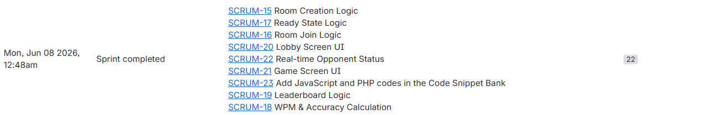

> Detail:


| Issue | Summary | Assignee |
|---|---|---|
| SCRUM-15 | Room Creation Logic (+5) | Utsa |
| SCRUM-16 | Room Join Logic (+5) | Utsa |
| SCRUM-17 | Ready State Logic (+5) | Utsa |
| SCRUM-18 | WPM & Accuracy Calculation | Utsa |
| SCRUM-19 | Leaderboard Logic (+5) | Utsa |
| SCRUM-20 | Lobby Screen UI (+3) | Adib |
| SCRUM-21 | Game Screen UI (+5) | Adib |
| SCRUM-22 | Real-time Opponent Status (+4) | Utsa |
| SCRUM-23 | Add JS & PHP snippets (+4) | Adib |

---

**Sprint 3 — Polish, Testing & Deployment** — *Rematch, language selector, visual polish, mobile, error handling, hosting.* 43 issues (8 Tasks + 35 Subtasks).

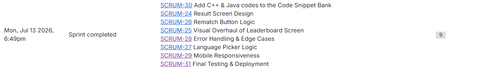

> Detail:

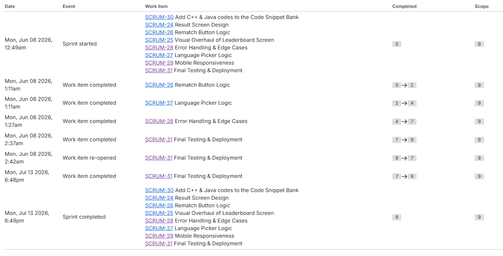

| Issue | Summary | Assignee |
|---|---|---|
| SCRUM-24 | Result Screen Design (+4) | Adib |
| SCRUM-25 | Visual Overhaul — Leaderboard (+4) | Adib |
| SCRUM-26 | Rematch Button Logic (+5) | Utsa |
| SCRUM-27 | Language Picker Logic (+5) | Utsa |
| SCRUM-28 | Error Handling & Edge Cases (+5) | Utsa |
| SCRUM-29 | Mobile Responsiveness (+4) | Adib |
| SCRUM-30 | Add C++ & Java snippets (+4) | Adib |
| SCRUM-31 | Final Testing & Deployment (+4) | Rafsan |

### Task Division & Contributions

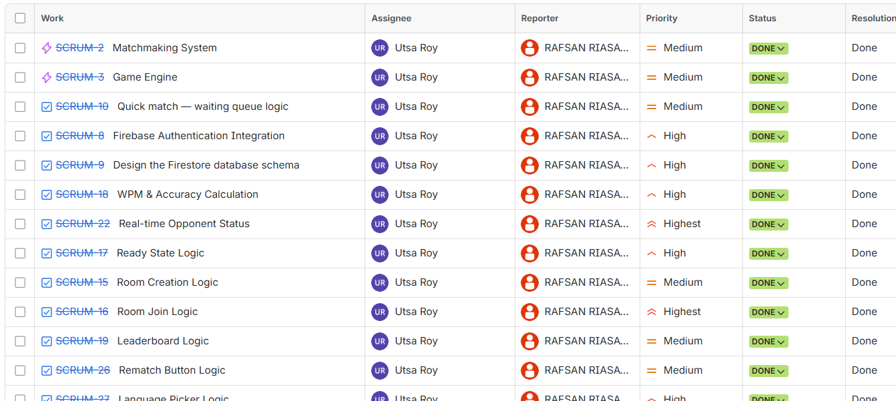
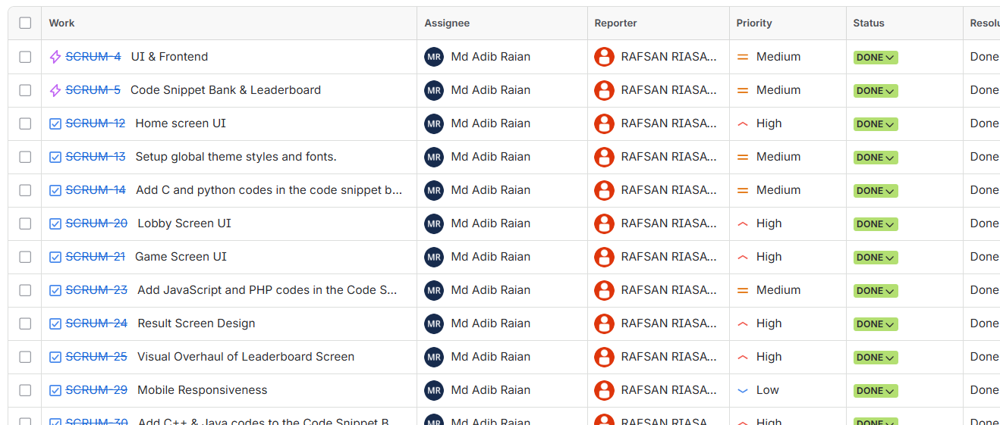
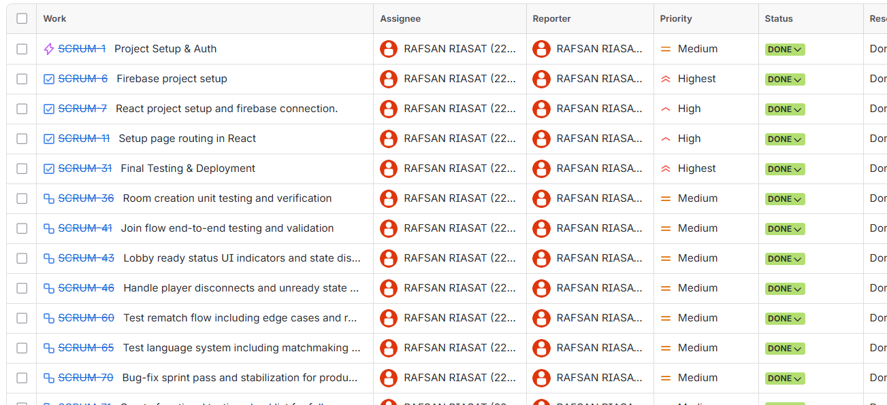

- **Rafsan Riasat (Scrum Master)** — Firebase config & scaffolding, React Router, Scrum ceremonies, cross-cutting QA, security rules, production deploy — 16 issues.
- **Utsa Roy (Backend / Game Engine)** — Auth, Firestore schema, matchmaking queue, room create/join, ready sync, WPM/Accuracy engine, opponent tracking, leaderboard backend, rematch state machine, language picker, edge cases — 45 issues.
- **Md Adib Raian (Frontend / UI)** — Home/Lobby/Game/Result/Leaderboard UIs, global theme & fonts, mobile responsiveness, snippet bank (6 languages) — 52 issues.

### Jira Workflow

Time-boxed 1-2 week sprints · Backlog → 5 Epics → Tasks → Subtasks (atomic coder actions).

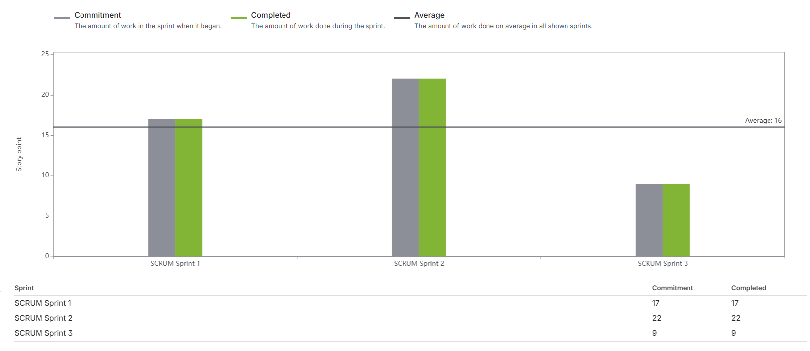

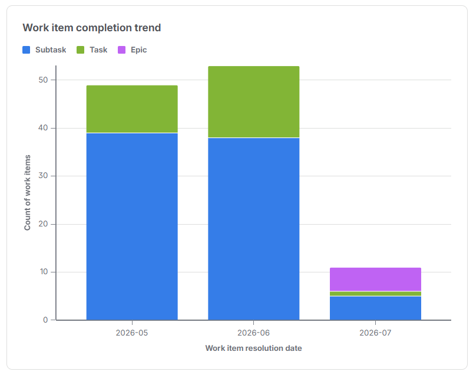

**Jira ↔ GitHub Integration** — 1) Jira ticket → 2) `SCRUM-{n}-{slug}` branch → 3) GitHub PR → 4) Jira auto-transitions to Done:

| Step 1 | Step 2 | Step 3 | Step 4 |
|---|---|---|---|
| 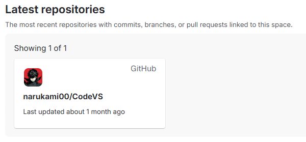 | 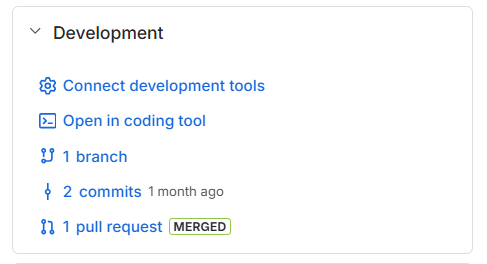 | 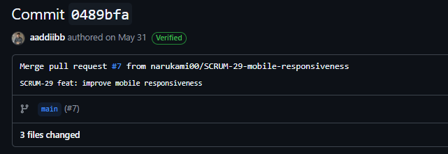 | 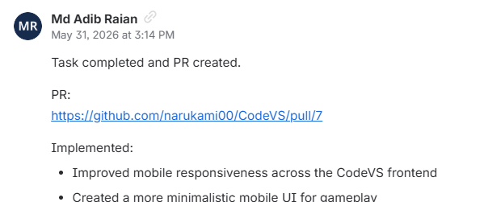 |

---

## 🔀 Version Control & Git Workflow

**Branching:** `main` is the protected production branch. No direct commits. Every feature is a `SCRUM-{number}-{slug}` branch auto-linked to its Jira issue.

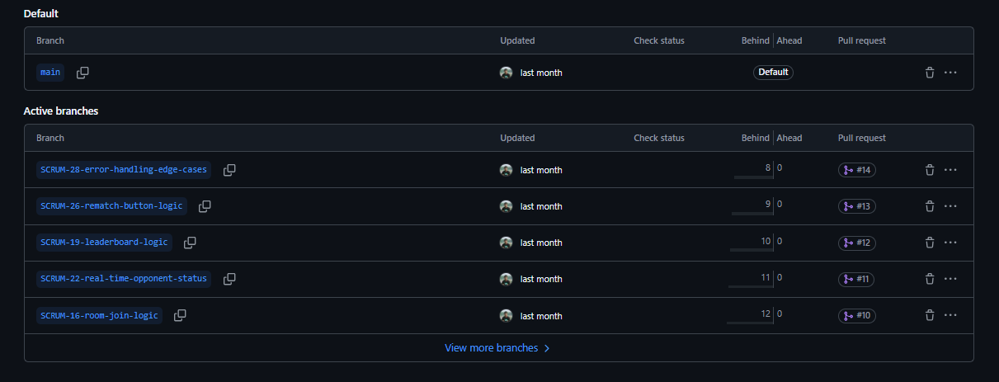

**Commit traceability:** 31 total commits · 14 pull requests · **68% commits carry a Jira ID** · 3 active contributors.

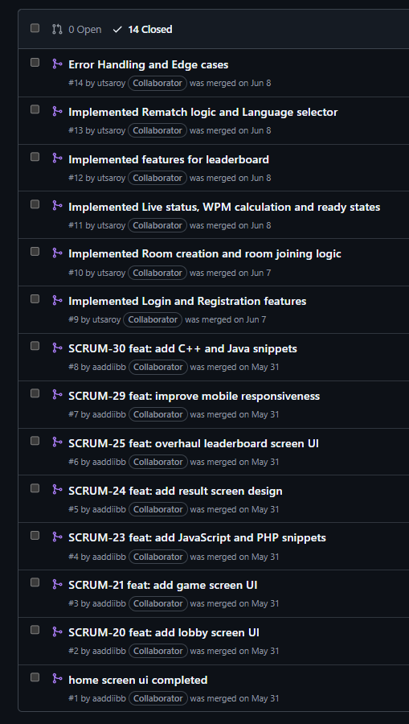


**Pull Requests & Branches:**

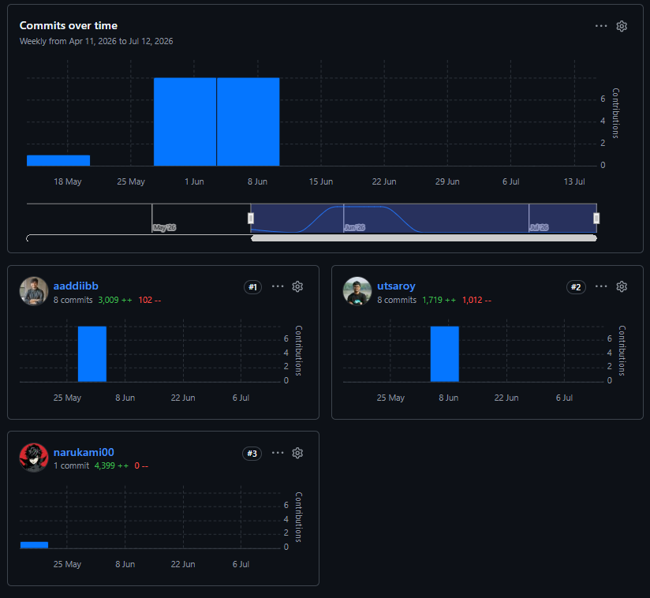
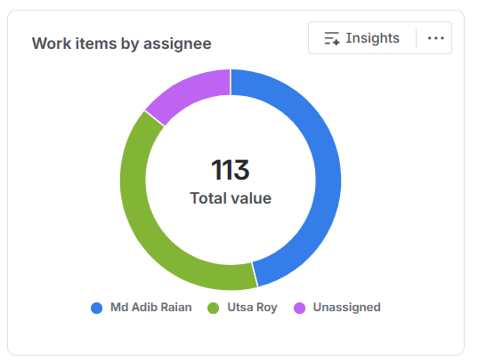
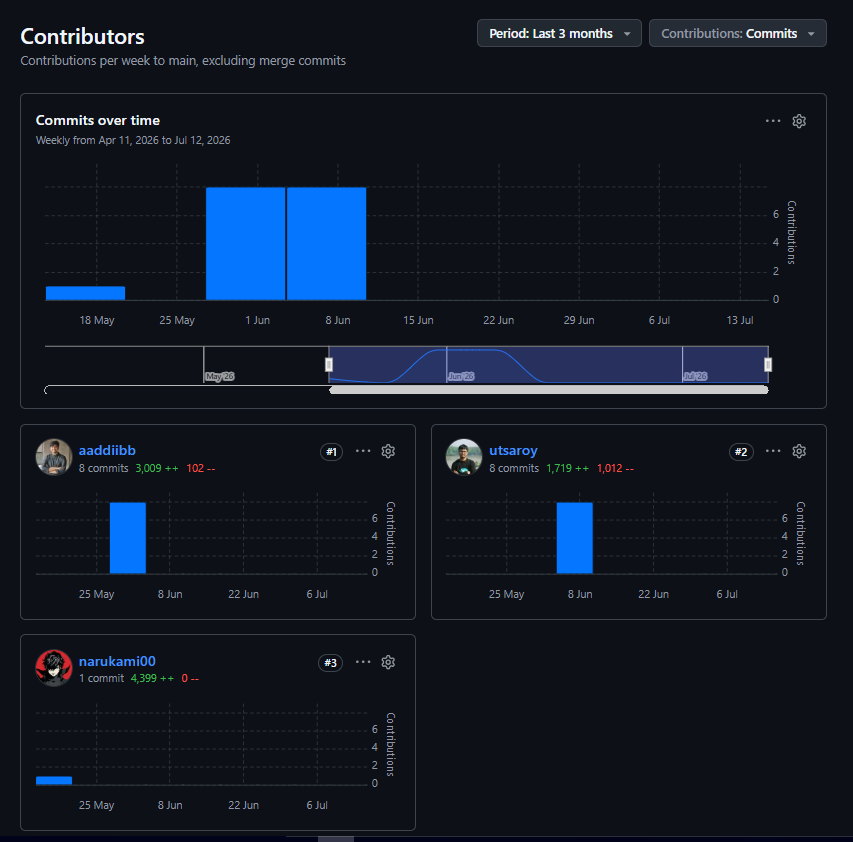

Key chronological commits span `SCRUM-8` (auth) → `SCRUM-20/21/24/25` (screen UIs) → `SCRUM-26/27` (rematch/language) → `SCRUM-28/29` (edge cases/mobile) → production deploy.

---

## 🧪 QA & Zephyr Scale — Test Cycle

> Managed via **Zephyr Scale for Jira** (project `SCRUM`). Screenshots from PPT slide 31 + docx §8.

| Test Cycle | Cases | Execution | Coverage |
|---|---|---|---|
| 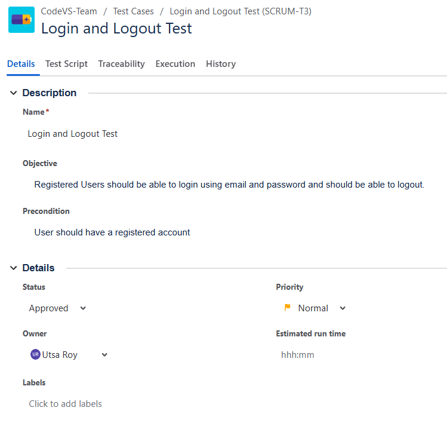 | 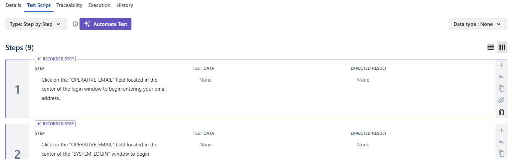 | 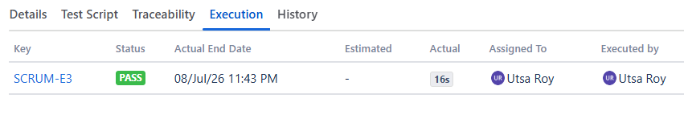 | 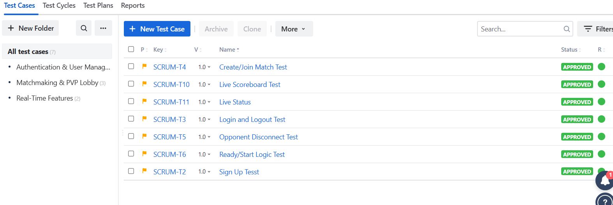 |

> Docx test overview (§8):

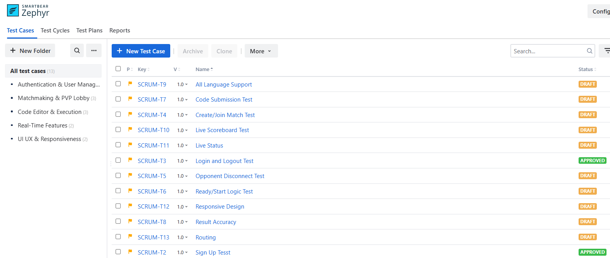

| Area | Cases |
|---|---|
| **8.1 Authentication & User Management** | Login/logout, registration validation, session termination, username uniqueness |
| **8.2 Matchmaking & Room Flow** | Create `XXXXXX` room, join validation, presence & disconnect notification, ready handshake + 3-2-1 countdown |
| **8.3 Game Engine** | Final char locks input, `game → completed`, WPM `(100/5)/(30/60)=40`, Accuracy `95/100=95%`, sub-250 ms opponent bar |
| **8.4 Leaderboard & Persistence** | Fetch & sort by WPM desc, dynamic refresh after game, per-stroke RTDB writes |
| **8.5 UI/UX & Responsiveness** | 375 px / 768 px / 1200 px+ — no clipping/overflow, protected-route guards |

At report time, all test definitions were complete; execution was being finalised with expected full resolution shortly after submission.

---

## 📈 Project Outcomes & Metrics

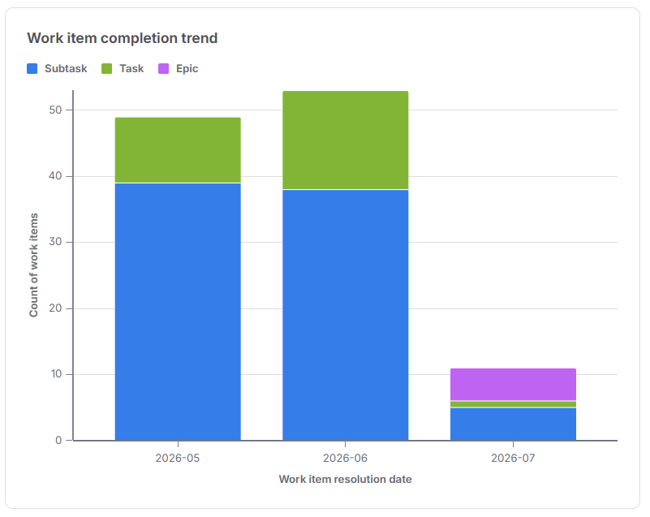
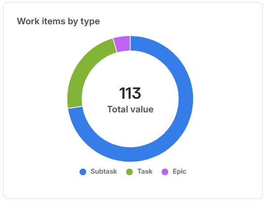

| Metric | Value |
|---|---|
| Total Jira Issues | **113** |
| Resolution Rate | **100%** |
| Sprints Delivered | **3** |
| Production Commits | **31** |
| Pull Requests Merged | **14** |
| Jira-Linked Branches | **13** |
| Supported Languages | **6** (+ Random) |
| UI Screens | **7** (Landing, Auth×2, Lobby, Game, Result, Leaderboard, Profile) |
| Opponent Progress Latency | **<250 ms** |
| Auth | Firebase Email/Password |
| Hosting | Firebase `codevs-a9bf1.web.app` |

---

## 🗂 Assets Index

> **76 unique images** extracted from 4 sources, deduplicated by SHA-256 (11 docx↔pptx overlaps collapsed). Full manifest: [`docs/assets/INDEX.md`](docs/assets/INDEX.md) + reproducible `_manifest.json`.

| Source | Images | Notes |
|---|---|---|
| `CodeVS_Project_Report.docx` | 22 `word/media/*` | §3 diagrams → Jira/Git tables |
| `CodeVS_Project_Report.pdf` | 24 page images (32 pages) | `fitz` pixmap extraction |
| `CodeVS_Workflow_Presentation.pptx` | 47 `ppt/media/*` (4 decorative excluded) | 34 slides |
| `CodeVS_Zephyr_Testing_Report.docx` | 0 + thumbnail | No embedded media beyond `docProps/thumbnail.jpeg` |

Naming: `uml-*` / `dfd-*` / `*-diagram` for diagrams, `ui-*` for screenshots, `jira-*` / `screenshot-jira-*`, `github-*` / `git-*`, `zephyr-*`, `pdf-pageXX-*`, `outcomes-*`.

---

## 🚀 Local Setup Guide

### Prerequisites

- **Node.js ≥ 18** (Vite 8 requires modern Node)
- **npm** (or `yarn`/`pnpm`)
- A **Firebase project** with Auth (Email/Password), Firestore, and Realtime Database enabled

### 1) Clone & Install

```bash
git clone https://github.com/narukami00/CodeVS.git
cd CodeVS/codevs
npm install
```

### 2) Environment

```bash
cp .env.example .env
# then fill in your Firebase web app credentials
```

`codevs/.env` (all `VITE_`-prefixed so Vite exposes them client-side — see `codevs/src/firebase.js:6-14`):

```ini
VITE_FIREBASE_API_KEY=your_api_key
VITE_FIREBASE_AUTH_DOMAIN=your_project.firebaseapp.com
VITE_FIREBASE_DATABASE_URL=https://your_project-default-rtdb.firebaseio.com
VITE_FIREBASE_PROJECT_ID=your_project_id
VITE_FIREBASE_STORAGE_BUCKET=your_project.appspot.com
VITE_FIREBASE_MESSAGING_SENDER_ID=your_sender_id
VITE_FIREBASE_APP_ID=your_app_id
```

> Get these from **Firebase Console → Project Settings → General → Your apps → SDK setup and configuration**.

### 3) Firebase Console Setup

- **Authentication → Sign-in method:** enable **Email/Password**.
- **Firestore Database:** create database (test mode for local dev; harden rules before prod). Create collections:
  - `users` (auto-created on register)
  - `snippets` — documents with `{ code: string }`
  - `snippet_metadata` — one doc per language (`c`, `python`, `javascript`, `cpp`, `java`, `php`) with `{ ids: string[] }` listing the snippet IDs for that language
- **Realtime Database:** create database; rules should allow authenticated `rooms`, `queues`, `matchmaking_results` (see repo's `database.rules.json` if present; otherwise start in test mode and tighten).

Seed at least a few snippets via the console or a small script — the app falls back to a mock JS snippet (`Game.jsx:14-17`) if a snippet is missing, but the snippet bank population is part of SCRUM-14/23/30.

### 4) Run

```bash
npm run dev      # http://localhost:5173
npm run lint     # eslint .
npm run build    # production build → dist/
npm run preview  # preview the build
```

### 5) Test the Flow

1. Register two users (or use two browsers/incognito).
2. On `/`, pick a language → **Quick Match** (both pick same language, or `Random`) — or **Create Room** on one side and **Join via Room Code** on the other.
3. In `/lobby?roomId=XXXXXX`, both click **I am Ready** → auto 3-2-1 via `countdownStart` → `/game`.
4. Type the snippet — observe live opponent progress and WPM/Accuracy.
5. Finish → `/result` — check winner, stats, **Request Rematch** (private rooms), and `/leaderboard` for updated `average_wpm`.

---

## ☁️ Deployment

`codevs/firebase.json:1-16`:

```json
{
  "hosting": {
    "public": "dist",
    "ignore": ["firebase.json", "**/.*", "**/node_modules/**"],
    "rewrites": [{ "source": "**", "destination": "/index.html" }]
  }
}
```

```bash
npm run build
firebase login
firebase deploy --only hosting        # or: npm run deploy
# Live at https://codevs-a9bf1.web.app
```

Ensure `firebase-tools` is installed (`npm i -g firebase-tools`) and `.firebaserc` points to your project ID (`codevs-a9bf1` in the report).

---

## 👥 Team

| Member | ID | Role | Scope |
|---|---|---|---|
| **Rafsan Riasat** | 2207006 | **Scrum Master** | Project scaffolding, Firebase init, React Router, Scrum ceremonies, cross-cutting QA, security rules, production deploy — 16 issues |
| **Utsa Roy** | — | **Developer (Backend / Game Engine)** | Auth, Firestore schema, matchmaking queue, room create/join, ready sync, WPM/Accuracy engine, opponent tracking, leaderboard backend, rematch FSM, language picker, edge cases — 45 issues |
| **Md Adib Raian** | — | **Developer (Frontend / UI)** | Home/Lobby/Game/Result/Leaderboard UIs, global theme & fonts, mobile responsiveness, snippet bank (6 languages) — 52 issues |

---

## 📎 Appendix — Full Asset Manifest

> Thumbnails below are PDF-rasterized extras (22 images) — rasterized as they appear in `CodeVS_Project_Report.pdf`. The canonical diagrams above are higher-fidelity.

<details>
<summary>PDF rasterized pages (click to expand)</summary>

| Page | Image |
|---|---|
| p3 | 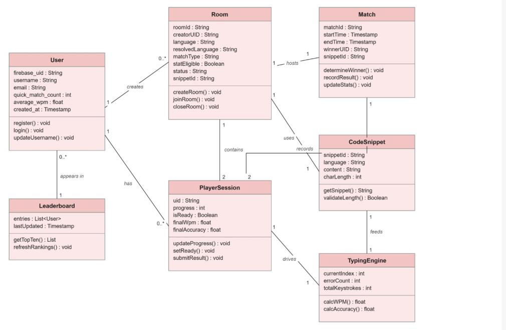 |
| p4 | 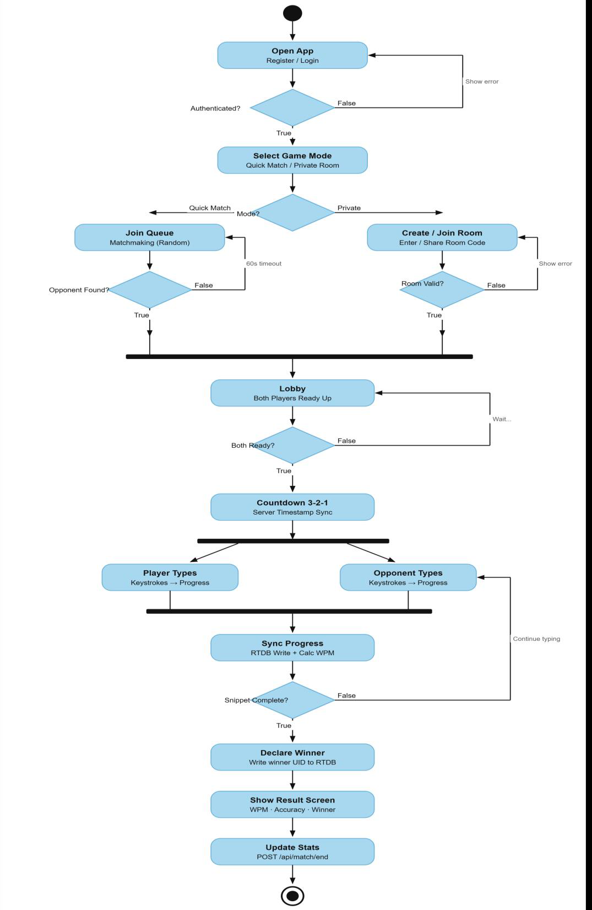 |
| p5 | 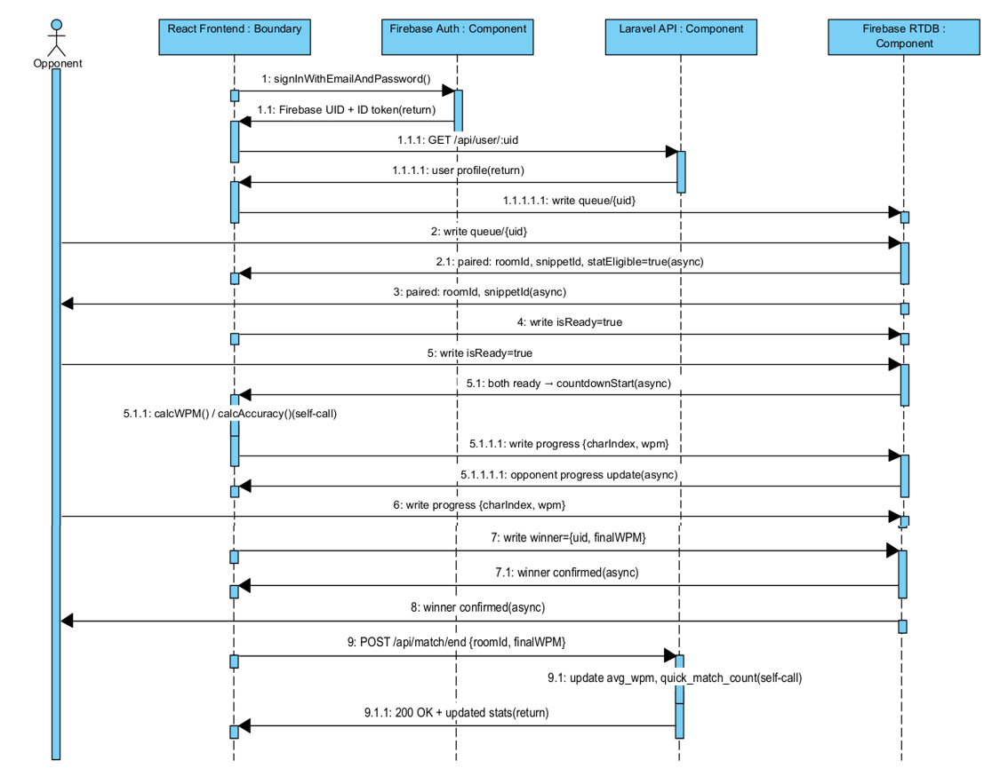 |
| p6 | 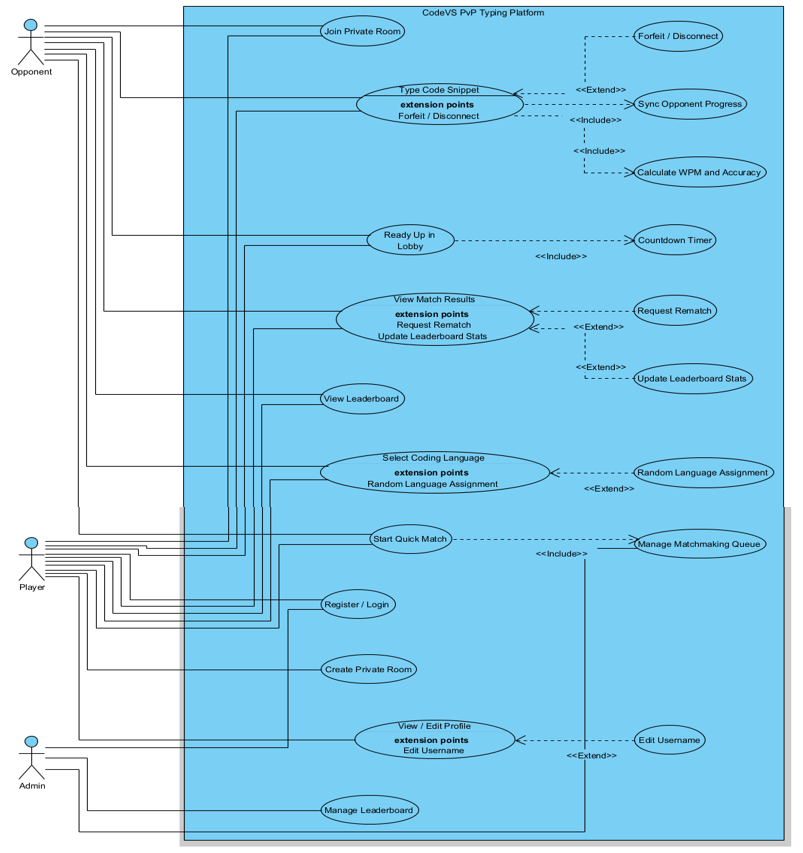 |
| p7 | 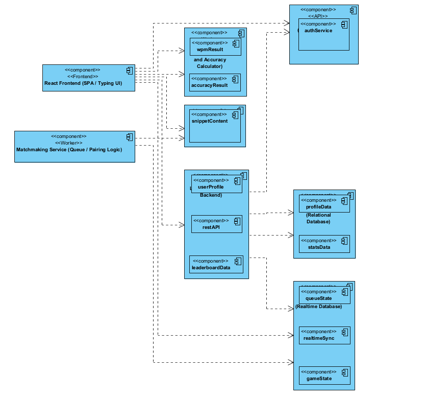 |
| p8 |   |
| p9 |  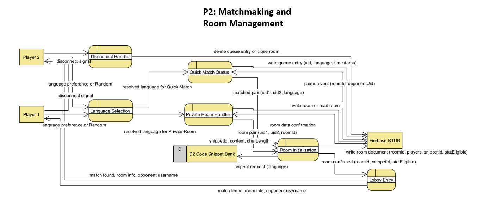 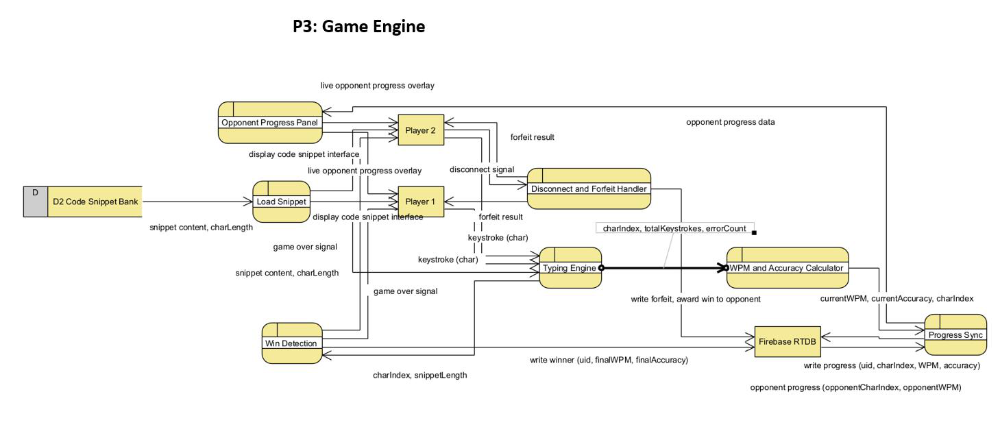 |
| p10 | 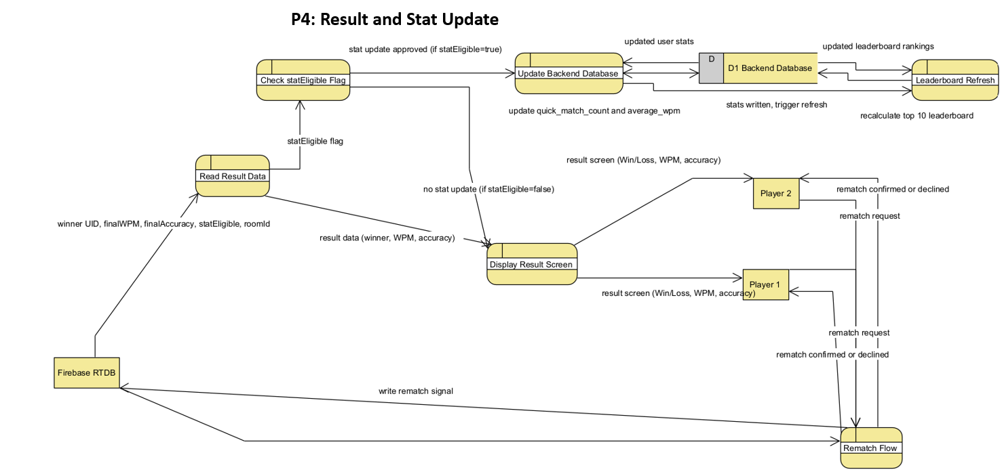  |
| p11 | 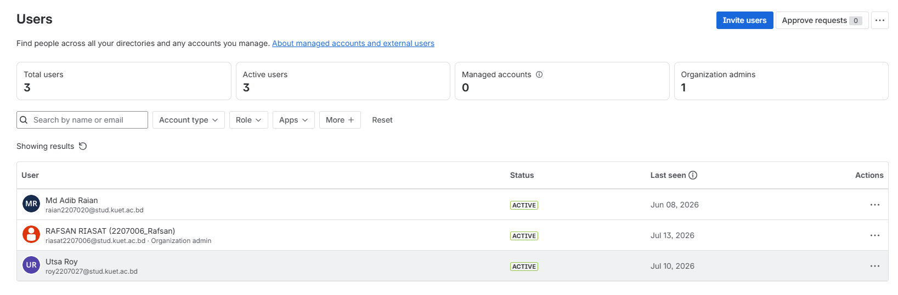 |
| p12 | 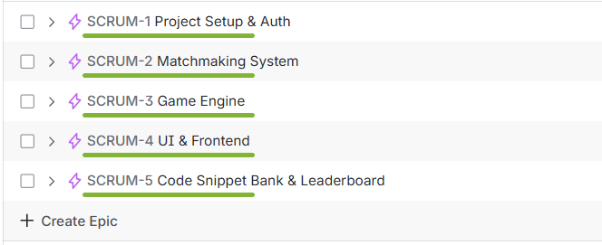 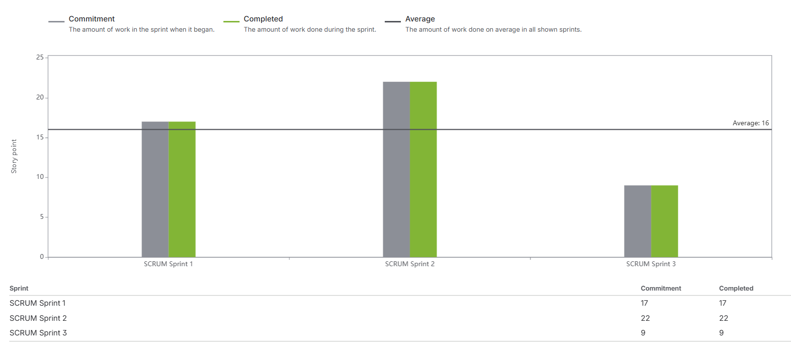 |
| p13 |  |
| p14 | 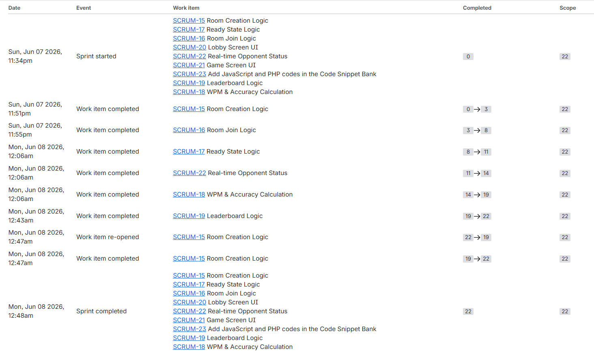 |
| p15 |  |
| p24 | 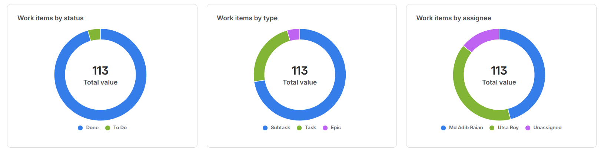 |
| p25 | 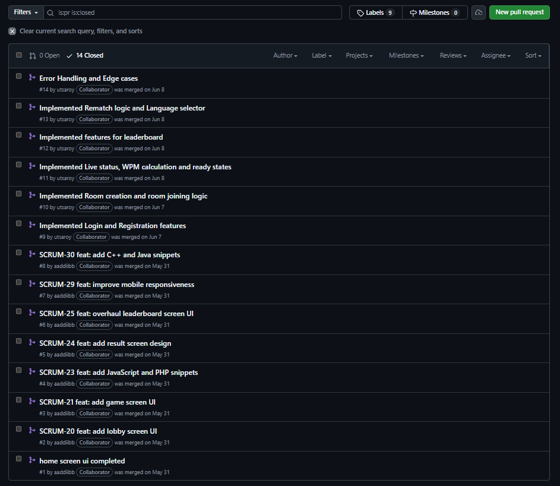 |
| p27 |  |
| p28 |  |

</details>

<details>
<summary>Deduplication map — docx ↔ pptx same hash (11 overlaps)</summary>

| Semantic file | docx `word/media/*` | pptx `ppt/media/*` | Hash |
|---|---|---|---|
| `uml-class-diagram.jpg` | `word/media/image1.jpeg` | `ppt/media/image2.jpeg` | `7a64bdde2600` |
| `use-case-diagram.png` | `word/media/image4.png` | `ppt/media/image7.png` | `8ddc16ba2fd2` |
| `activity-diagram.png` | `word/media/image2.png` | `ppt/media/image8.png` | `46ea712f2382` |
| `sequence-diagram.png` | `word/media/image3.png` | `ppt/media/image9.png` | `2a2c75116ee2` |
| `dfd-level0-context.png` | `word/media/image6.png` | `ppt/media/image10.png` | `20495759f655` |
| `dfd-level1-main-processes.png` | `word/media/image7.png` | `ppt/media/image11.png` | `95e22745e822` |
| `dfd-level2-a.png` | `word/media/image8.png` | `ppt/media/image12.png` | `2ca9fb8b9ecb` |
| `dfd-level2-b.png` | `word/media/image9.png` | `ppt/media/image13.png` | `927b43c120e4` |
| `dfd-level2-c.png` | `word/media/image10.png` | `ppt/media/image14.png` | `fdaedba3b8ff` |
| `dfd-level2-d.png` | `word/media/image11.png` | `ppt/media/image15.png` | `24cd30194eb5` |
| `dfd-level2-e.png` | `word/media/image12.png` | `ppt/media/image16.png` | `c1a834eb4ae0` |

</details>

---

<p align="center">
  <sub>Built with ❤️ by the CodeVS team — Information System Design Laboratory · Agile Scrum · Jira Cloud · GitHub · Zephyr Scale · Firebase</sub><br>
  <sub>Sources: <code>CodeVS_Project_Report.docx</code> · <code>CodeVS_Project_Report.pdf</code> · <code>CodeVS_Workflow_Presentation.pptx</code> · <code>CodeVS_Zephyr_Testing_Report.docx</code> · <code>codevs/src/**</code></sub>
</p>
